# Arc - Habit builder

A minimal habit tracker designed for mobile users to build consistency through visual progress. Track multiple types of habits with ease, focusing on what matters, with minimum friction. 

[Live Demo](https://stefan0712.github.io/arc/)


## Tech Stack

**Framework:** React 19 (TypeScript)

**Styling:** Tailwind CSS v4

**Routing:** React Router 7

**State Management:** Zustand

**Animations:** Framer Motion

**Database:** Dexie.js

**Icons & Utils:** Lucide React & date-fns

## Key Features

### Daily Logging & Dashboard

See all your goals at a glance, with intuitive UI showing your current status. Logging without friction means you are more likely to track your goals. You can manually input a number, pick a default value set by you, or just skip logging the habit today.

<table width="100%">
  <tr>
    <td width="33%" align="center">
      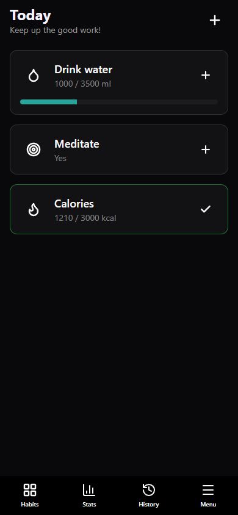
    </td>
    <td width="33%" align="center">
      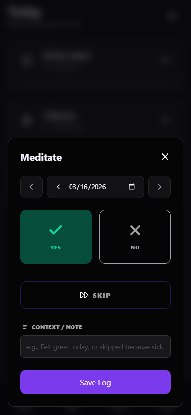
    </td>
    <td width="33%" align="center">
      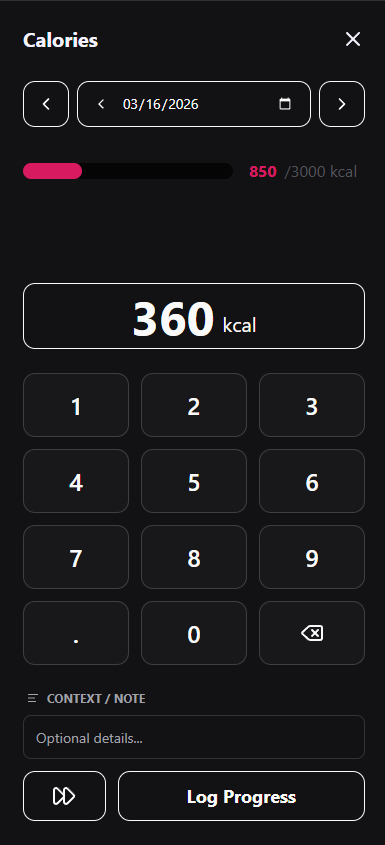
    </td>
  </tr>
</table>

### Custom Habit Creation

You decide how you want to track your habit. Right now you can choose between a numeric target with custom completion criteria, or a boolean type where you only answer with "Yes" or "No".  You can customize your goals by choosing a custom color and icon, and you can even allow yourself to skip that goal without affecting your progress.

<table width="100%">
  <tr>
    <td width="33%" align="center">
      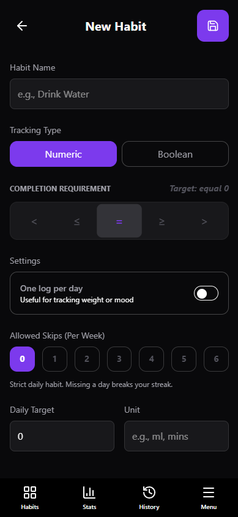
    </td>
    <td width="33%" align="center">
      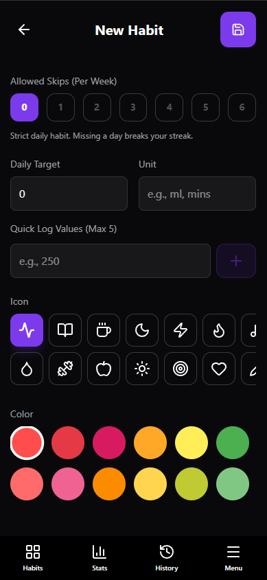
    </td>
    <td width="33%" align="center">
      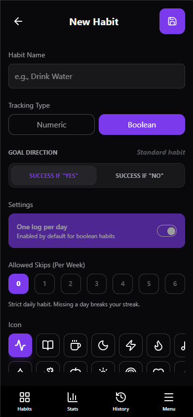
    </td>
  </tr>
</table>

### Progress and Analytics

See a quick overview of your current week or month, and see how you are doing for each habit.

<table width="100%">
  <tr>
    <td width="33%" align="center">
      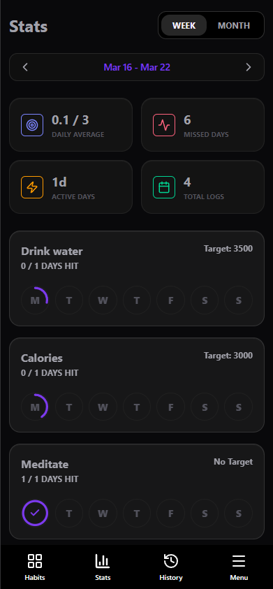
    </td>
    <td width="33%" align="center">
      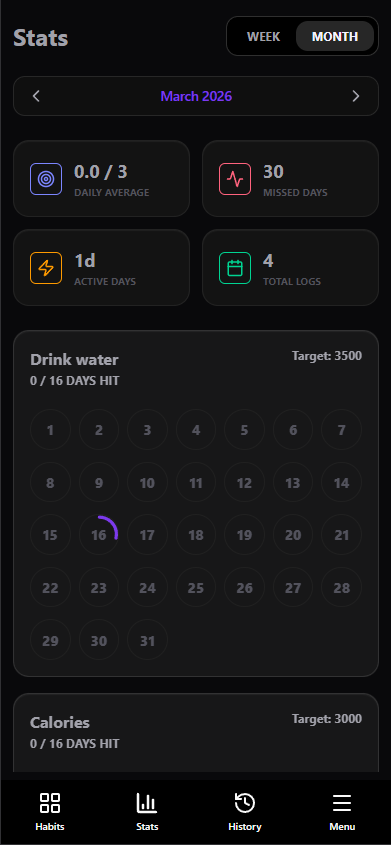
    </td>
    <td width="33%" align="center">
      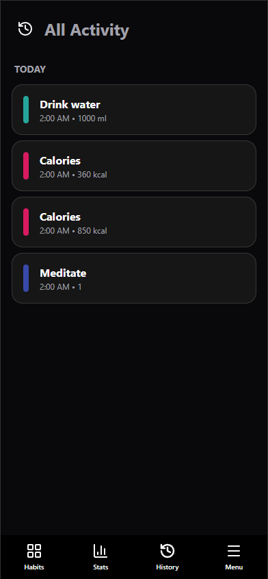
    </td>
  </tr>
</table>

### App Settings and Customization

Make the app to be truly yours by changing the accent color, pick one of the pre-made themes, and tweak app settings and roundness of the UI.

<table width="100%">
  <tr>
    <td width="33%" align="center">
      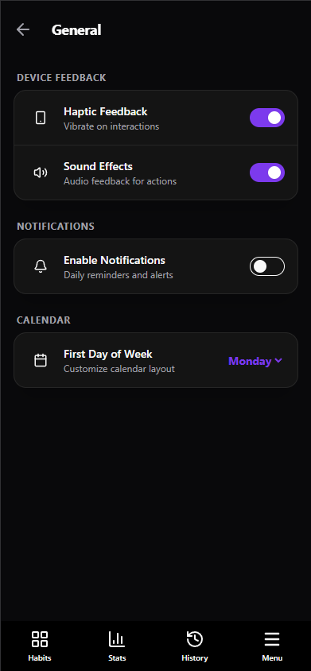
    </td>
    <td width="33%" align="center">
      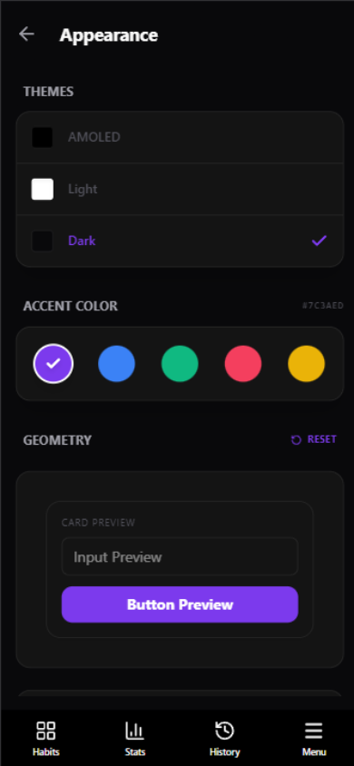
    </td>
    <td width="33%" align="center">
      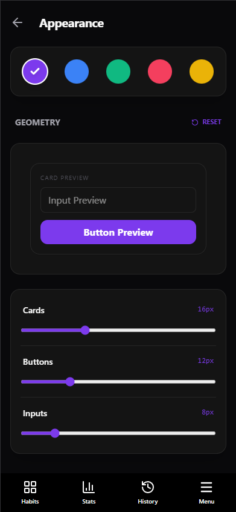
    </td>
  </tr>
</table>

### Data Management

Import and export all of your data with ease in case you want to back-up or move to another device

<table width="100%">
  <tr>
    <td width="33%" align="center">
      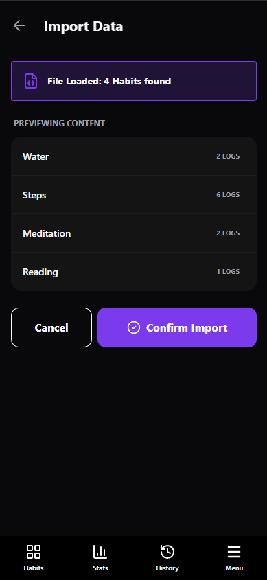
    </td>
    <td width="33%" align="center">
      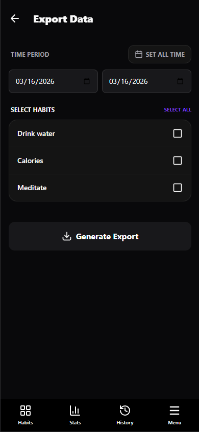
    </td>
    <td width="33%" align="center">
      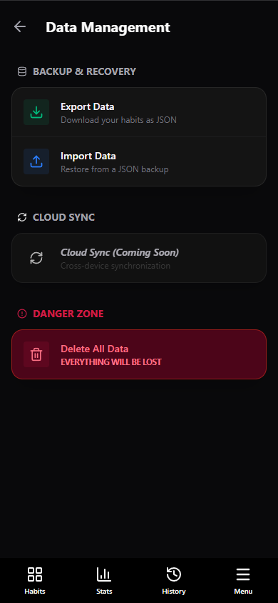
    </td>
  </tr>
</table>

## Roadmap

Planned features that will be added in the future

### 1. Composite Habits.

A new type of habit that is completed by checking sub-tasks. This allows for more complex habits that can't be tracked by only logging a number or answering yes/no.

**Flexible Logic:** Users can define completion based on:
 * **All-or-Nothing:** Every sub-item must be checked.
 * **Minimum Threshold:** Goal is met after $X$ items are cleared.
 * **Required Dependencies:** Specific mandatory items must be checked, while others remain optional.
 * **Manual Override:** The ability to check the parent goal directly regardless of sub-item state.

### 2. Streaks and gamification

To drive long-term consistency, I will implement a "Streak & Leveling" system designed to reward progress and nudge users back into their routines.

* **Smart Streaks:** Logic that recognizes a "Skip" as a neutral event, preserving the streak while maintaining data integrity.
 
* **Habit Leveling:** Each habit will feature a dynamic level based on total successful logs, providing a long-term sense of "RPG-style" progression.

* **Achievement System:** Milestones (badges) awarded for total logs, concurrent active habits, and "All-Time High" streaks.

### 3. Multiplayer Habits

Accountability is strongest when shared. This feature will transition the app from a solo tool to a social one.

* **Shared Progress Cards:** A unified UI component showing real-time progress bars for each participant side-by-side.

* **Privacy Controls:** Authors can toggle whether specific log values or timestamps are visible to the group or kept private.

* **Comparative Analytics:** A dedicated "Shared View" for auditing group history and comparing performance metrics between members.

* **Technical Implementation:** This will involve migrating from a local-only architecture to a hybrid model with a Node.js backend to handle Authentication, Invite Workflows, and real-time data syncing.


## 🚀 Installation & Getting Started

Follow these steps to get a local copy of the project up and running.

### Prerequisites

* **Node.js** (v18.0.0 or higher recommended)
* **npm** or **pnpm**

### Setup

1. **Clone the repository**
```bash
git clone [https://github.com/stefan0712/arc.git](https://github.com/stefan0712/arc.git)
```

2. Navigate to the project directory
```bash
cd arc
```

3. Install dependencies
```bash
npm install
```

4. Start the development server
```bash
npm run dev
```
### License & Contact

Distributed under the MIT License. This project is open for educational purposes and personal use.

Developed by Stefan Vladulescu

* [LinkedIn Profile](https://www.linkedin.com/in/stefan-vladulescu/)

* [Personal Website](https://www.stefanvladulescu.com)

* Email: s.vladulescu@gmail.com